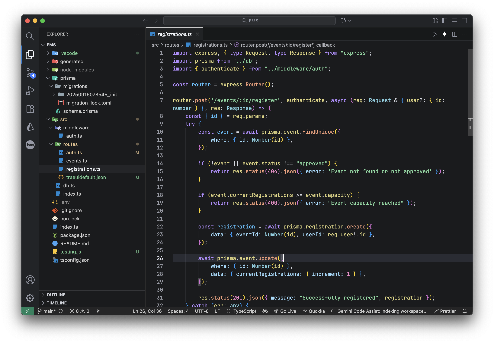
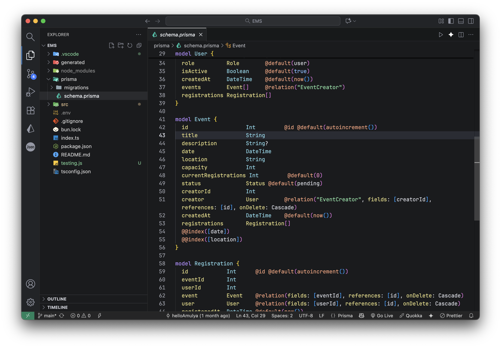

# Trae dark (code) Theme

A custom dark VS Code theme inspired by Trae, featuring a sleek dark interface with improved syntax highlighting for better readability.

## Screenshots
## Screenshots




## Installation

### From VS Code Marketplace
1. Open VS Code.
2. Go to the Extensions view (Ctrl+Shift+X).
3. Search for "Trae dark (code)".
4. Click Install.

### Manual Installation (from GitHub or VSIX)
1. Download the .vsix file from the [Releases](https://github.com/yourusername/my-trae-theme/releases) page (or build it yourself).
2. In VS Code, go to Extensions view > ... menu > Install from VSIX.
3. Select the .vsix file.

To build from source:
1. Clone the repo: `git clone https://github.com/helloAmulya/traecodetheme.git`
2. Install vsce: `npm install -g vsce`
3. Package: `vsce package`
4. Install the generated .vsix as above.

## Usage
1. After installation, go to File > Preferences > Color Theme (or Ctrl+K Ctrl+T).
2. Select "Trae dark (code)".

## Recommended Settings
To match the original setup (including font and line height), add these to your VS Code `settings.json` (File > Preferences > Settings > Open Settings (JSON)):

```json
{
  "workbench.colorTheme": "My Trae Theme",
  "editor.fontFamily": "'JetBrains Mono', monospace",
  "editor.fontSize": 14,
  "editor.fontWeight": "normal",
  "editor.fontLigatures": false,
  "editor.lineHeight": 1.5
}
```